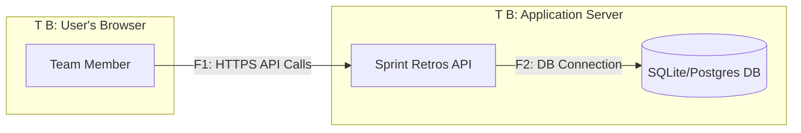

# DFD — Data Flow Diagram

## Диаграмма (Mermaid)

## Список потоков

| ID | Откуда → Куда | Канал/Протокол | Данные | Комментарий |
|----|---------------|----------------|--------|-------------|
| F1 | Пользователь → API | HTTPS | JSON с данными ретро (тексты, даты), JWT токен в заголовке | Основной канал взаимодействия с сервисом. |
| F2 | API → База данных | TCP (SQL-протокол) | SQL-запросы, записи о ретроспективах и пользователях | Внутреннее взаимодействие с хранилищем. |
